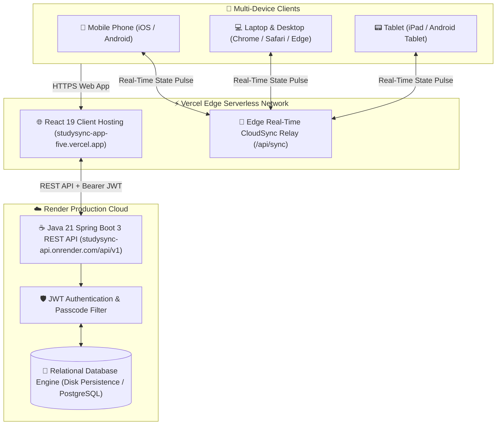

# 🎓 StudySync — Modern Full-Stack Academic Productivity Platform

<div align="center">


### *Plan with clarity. Study with focus. Sync everywhere.*

[](https://studysync-app-five.vercel.app)
[](https://studysync-api.onrender.com)
[](https://github.com/ravichavan9970/StudySync)

<br/>

[](https://react.dev/)
[](https://spring.io/projects/spring-boot)
[](https://openjdk.org/)
[](https://vitejs.dev/)
[](https://vercel.com/)
[](https://www.docker.com/)

</div>

---

## 🌟 Overview

**StudySync** is a high-performance, full-stack student productivity ecosystem designed for modern learners, software engineers, and researchers. It unifies daily study momentum, smart task management, formula cheat sheets & notes, distraction-free Pomodoro deep work sessions, weekly calendar planning, and real-time analytics into a single cross-device application.

Equipped with a **Universal CloudSync Engine**, your workspace, profile picture, tasks, and notes synchronize across **Mobile, Laptop, Desktop, and Tablet** in milliseconds with strict multi-tenant isolation.

---

## 🚀 Key Highlights

- ⚡ **Universal Cross-Device Synchronization**: Instant, real-time bidirectional state sync across all viewports with continuous heartbeat polling and automatic visibility resync.
- 🔒 **Multi-Tenant Data Isolation**: Complete separation of student data. Every account (`Ravi`, `Shrikant`, and every new user) gets an isolated workspace vault.
- 📸 **High-Definition Profile Cropper**: Integrated 360px HD image cropper with full mobile touch drag and pinch-to-zoom capabilities (supports photos up to 3MB).
- ⏱️ **Integrated Pomodoro & Focus Zone**: Link focus sessions directly to academic tasks and auto-mark tasks as conquered upon timer completion.
- 🛡️ **Master Admin Operations Hub (`/admin`)**: Dedicated command center for system administrators with live roster audits, aggregated statistics, and database reset controls.
- 🎨 **Adaptive Themes & Dark Mode**: Dynamic color accents (*Violet, Teal, Rose, Amber, Cyan*) and light/dark theme switching.

---

## 🏛️ System Architecture



---

## 📱 Feature Showcase

<details open>
<summary><b>1. 📊 Interactive Dashboard Overview (<code>/dashboard</code>)</b></summary>
<br/>
Real-time study command center displaying daily target progress rings, urgent priority tasks, course breakdowns with customized colors, and a 1-click focus launcher.
</details>

<details open>
<summary><b>2. 📝 Smart Task Management (<code>/tasks</code>)</b></summary>
<br/>
Organize coursework by priority levels (<i>High, Medium, Low</i>), due dates, and focus intervals. Filter dynamically by <b>All Tasks</b>, <b>Due Today</b>, <b>Upcoming</b>, and <b>Completed</b> with zero data loss.
</details>

<details open>
<summary><b>3. 📚 Knowledge Base & Study Notes (<code>/notes</code>)</b></summary>
<br/>
Rich digital workspace for lecture notes, formulas, and code summaries. Pin critical notes to the top, search in real-time, and organize into active or archived folders.
</details>

<details open>
<summary><b>4. 🗓️ 7-Day Weekly Study Planner (<code>/planner</code>)</b></summary>
<br/>
Monday-to-Sunday visual study calendar allowing students to schedule and balance academic workload day-by-day.
</details>

<details open>
<summary><b>5. ⏱️ Deep Work & Pomodoro Focus Room (<code>/focus</code>)</b></summary>
<br/>
Distraction-free focus timer featuring preset intervals (25m Pomodoro, 50m Deep Flow, 5m Sprint) linked directly to coursework items.
</details>

<details open>
<summary><b>6. 📈 Momentum & Habit Analytics (<code>/analytics</code>)</b></summary>
<br/>
Visual bar charts and metrics tracking completed tasks, weekly focus hours, daily study streaks, and productivity indices.
</details>

<details open>
<summary><b>7. 🛡️ Master Admin Command Hub (<code>/admin</code>)</b></summary>
<br/>
Restricted administrator portal for <b><code>Ravi@7447</code></b> to audit live system metrics, inspect all registered student accounts across devices, and manage global records.
</details>

---

## 🛠️ Technology Stack

| Layer | Technologies |
| :--- | :--- |
| **Frontend** | React 19.2, Vite 8.1, React Router 7.1, CSS3 Custom Properties |
| **Backend** | Java 21 LTS, Spring Boot 3.4.2, Spring Security, Spring Data JPA |
| **Edge Serverless** | Vercel Serverless Edge Functions (`/api/sync`), Node.js ES Modules |
| **Database** | PostgreSQL / H2 Disk Persistent Engine / MySQL |
| **Security** | Stateless JWT (JSON Web Tokens), BCrypt Password Hashing, Master Passcode Auth |
| **Container & Cloud** | Docker Multi-Stage, Render Cloud Web Services, Vercel Global Edge Network |

---

## ⚡ Quick Start (Local Setup)

### Prerequisites
- **Node.js** 18+ and **npm**
- **Java 21 JDK** and **Maven 3.9+**
- **Git**

### 1. Clone the Repository
```bash
git clone https://github.com/ravichavan9970/StudySync.git
cd StudySync
```

### 2. Run Backend (Terminal 1)
```bash
cd backend
mvn spring-boot:run
```
- *REST API Base*: `http://localhost:8080/api/v1`
- *Swagger UI*: `http://localhost:8080/api/v1/swagger-ui.html`
- *H2 Console*: `http://localhost:8080/api/v1/h2-console`

### 3. Run Frontend (Terminal 2)
```bash
cd frontend/studysync-frontend
npm install
npm run dev
```
- *Web App*: `http://localhost:5173`

---

## 🔐 Credentials & Default Access

| Portal | URL Path | Credentials |
| :--- | :--- | :--- |
| **Public Application** | `/` | Register or Login with any email |
| **Master Admin Hub** | `/admin` | Passcode: `StudySync#*&Master2026!Admin` |
| **Master Admin Account** | `/login` | `Ravi@7447` / `StudySync#*&Master2026!Admin` |

---

## 📁 Repository Structure

```text
StudySync/
├── backend/                             # Java 21 / Spring Boot 3 Cloud API
│   ├── pom.xml                          # Maven dependencies & build configuration
│   └── src/
│       ├── main/java/com/studysync/
│       │   ├── config/                  # SecurityConfig, AdminBootstrap, OpenApiConfig
│       │   ├── controller/              # Auth, Tasks, Notes, Subjects, Categories, Admin
│       │   ├── domain/                  # User, Task, Note, Subject, Category, Session entities
│       │   ├── dto/                     # Data Transfer Objects
│       │   ├── repository/              # Spring Data JPA Repositories
│       │   └── service/                 # Core business services
│       └── main/resources/
│           └── application.yml          # Production datasource & security config
├── frontend/
│   └── studysync-frontend/              # React 19 / Vite SPA
│       ├── api/
│       │   └── sync.js                  # Vercel Serverless Real-Time Cloud Sync Engine
│       ├── vercel.json                  # Edge routing & API rewrite rules
│       ├── src/
│       │   ├── components/              # Common, Dashboard, Tasks, Notes, Focus, Admin UI
│       │   ├── context/                 # AuthContext, StudySyncContext, ThemeContext
│       │   ├── pages/                   # Multi-page views & routes
│       │   ├── api.js                   # Universal CloudSync Engine & Client API
│       │   └── App.jsx                  # Main Application Shell
├── Dockerfile                           # Multi-stage Docker production build
├── render.yaml                          # Render Cloud blueprint configuration
└── README.md                            # Comprehensive project documentation
```

---

## 👨‍💻 Author & Maintainer

**Chavan Ravindra**  
- **Email**: [ravindrachavan265125@gmail.com](mailto:ravindrachavan265125@gmail.com)  
- **GitHub**: [@ravichavan9970](https://github.com/ravichavan9970)  
- **Project Repository**: [https://github.com/ravichavan9970/StudySync](https://github.com/ravichavan9970/StudySync)

---

<div align="center">
  <sub>Built with ❤️ for student communities and high-achievers worldwide.</sub>
</div>
