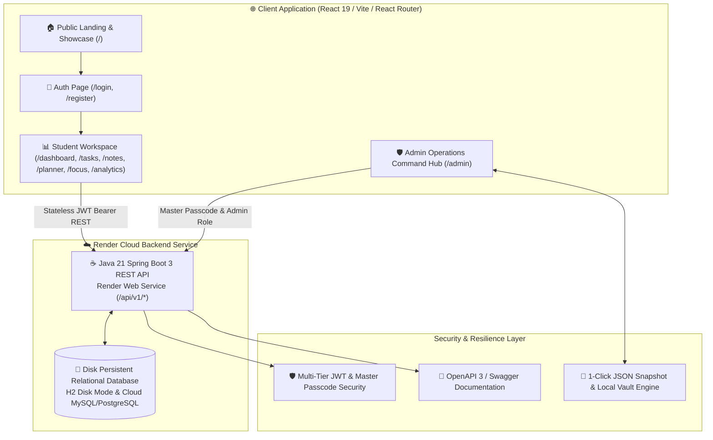

# 🎓 StudySync Enterprise Full-Stack
### Academic Productivity Suite, Deep Work Pomodoro & Dual-Cloud Resilience Platform

🌐 **Live Web Application**: [https://studysync-app.vercel.app](https://studysync-app.vercel.app)

[](https://spring.io/projects/spring-boot)
[](https://openjdk.org/)
[](https://react.dev/)
[](https://reactrouter.com/)
[](https://vitejs.dev/)
[](https://www.docker.com/)
[](https://render.com/)

> **StudySync** is a full-stack, enterprise-grade student productivity ecosystem designed for high-performing students, engineers, and researchers. It seamlessly integrates multi-page task lifecycles, rich knowledge base notes, distraction-free Pomodoro deep-work intervals, 7-day syllabus planning, momentum analytics, two-tier security, and dual-cloud disaster recovery.

---

## 🏛️ System Architecture



---

## ✨ Core Platform Modules

### 1. 🌐 Multi-Page Student Workspace (`react-router-dom`)
- **Interactive Overview Dashboard (`/dashboard`)**:
  - Daily target completion ring with dynamic SVG animated stroke.
  - Urgent priority task queue with 1-click focus launcher.
  - Active study subjects breakdown with course codes, progress percentages, and color palettes.
  - Deep focus promo callout.
- **Task Management Workspace (`/tasks`)**:
  - Filter tabs (*All Tasks, Due Today, Upcoming, Completed*) and live search.
  - Priority pills (*High, Medium, Low*), course associations, due dates, and timer duration presets.
  - In-line completion toggle and task editing.
- **Knowledge Base & Study Notes (`/notes`)**:
  - Rich formula cheat sheets and lecture summaries with category badge tags.
  - Pinning to folder top, archive/restore actions, and full-text search.
- **7-Day Weekly Study Planner (`/planner`)**:
  - Full Monday-Sunday calendar grid with daily task stacks and inline task creator.
- **Deep Work & Pomodoro Focus Room (`/focus`)**:
  - Animated circular SVG countdown timer (25m Pomodoro, 50m Deep Work, 5m Break).
  - Link session to specific task to automatically mark complete upon timer expiration.
  - Optional completion audio chime and flow state guidelines.
- **Productivity & Momentum Analytics (`/analytics`)**:
  - Completed task count, total recorded focus hours, streak counter, and momentum index.
  - Weekly comparative activity chart (Focus Minutes vs Completed Tasks).

---

### 2. 🛡️ Standalone Admin Command Hub (`/admin`)
- **Operations Auditor & User Roster**:
  - Real-time registered accounts table, roles, streak records, join dates, and account management.
  - System activity metrics: JVM memory consumption, active entity counts, and cloud server status.
- **Enterprise Disaster Recovery Engine**:
  - 💾 **`Export Full System Snapshot`**: 1-click timestamped JSON backup download.
  - 📥 **`Import & Restore Snapshot`**: Instant state reconstruction from any JSON backup file.
  - 🗄️ **`Lock Local Browser Vault`**: Freezes current data snapshot in browser offline storage.

---

### 3. ☕ Java 21 Spring Boot 3 Cloud Backend
- **Java 21 LTS** and **Spring Boot 3.4.2**.
- **Multi-Cloud Database Flexibility**:
  - Works out-of-the-box on Render with disk-persisted database storage (`jdbc:h2:file:/app/data/studysyncdb;AUTO_SERVER=TRUE`).
  - Supports external Cloud MySQL / PostgreSQL via `SPRING_DATASOURCE_URL` or `DB_URL`.
- **Stateless Bearer JWT Authentication** with BCrypt password encryption and row-level ownership validation.
- **High-precedence CORS configuration** supporting production domains (`*.onrender.com`, `*.vercel.app`, `localhost`).
- **OpenAPI 3 / Swagger Documentation**: `/api/v1/swagger-ui.html`.

---

## 🚀 Quick Run & Deployment Guide

### Local Development

#### 1. Backend Server (Terminal 1)
```bash
cd backend
mvn spring-boot:run
```
*API Base URL: `http://localhost:8080/api/v1`*  
*Swagger Docs: `http://localhost:8080/api/v1/swagger-ui.html`*  
*H2 Console: `http://localhost:8080/api/v1/h2-console`*

#### 2. Frontend Workspace (Terminal 2)
```bash
cd frontend/studysync-frontend
npm run dev
```
*Web Application: `http://localhost:5173`*

---

### Cloud Deployment (Render & Vercel)

#### 1. Deploy Backend on Render (Web Service)
1. Push repository to GitHub.
2. In [Render Dashboard](https://dashboard.render.com), click **New + Web Service**.
3. Select your repository and choose **Docker** runtime.
4. Set Docker Build Context to root and DockerfilePath to `Dockerfile`.
5. Add a Persistent Disk mounted at `/app/data` (1GB).
6. Set Environment Variables:
   - `PORT`: `8080`
   - `SPRING_DATASOURCE_URL`: `jdbc:h2:file:/app/data/studysyncdb;DB_CLOSE_DELAY=-1;DB_CLOSE_ON_EXIT=FALSE;AUTO_SERVER=TRUE`
   - `JWT_SECRET`: `your-strong-random-32-byte-secret`
   - `ADMIN_PASSCODE`: `StudySync#*&Master2026!Admin`

#### 2. Deploy Frontend on Vercel
1. In [Vercel Dashboard](https://vercel.com), import your repository.
2. Set Root Directory to `frontend/studysync-frontend`.
3. Set Framework Preset to **Vite**.
4. Set Environment Variable:
   - `VITE_API_URL`: `https://your-studysync-api.onrender.com/api/v1`
5. Click **Deploy**.

---

## 🔐 Credentials & Default Access

| Portal / Resource | Access URL | Credentials |
|---|---|---|
| **Public Web App** | `https://studysync-app.vercel.app` | Register or Demo Login |
| **Admin Command Hub** | `/admin` | Passcode: `StudySync#*&Master2026!Admin` |
| **Root Admin Login** | `/login` | `admin@studysync.io` / `StudySync#*&Master2026!Admin` |
| **H2 Web Console** | `/api/v1/h2-console` | JDBC: `jdbc:h2:file:./data/studysyncdb;AUTO_SERVER=TRUE`<br>User/Pass: `sa` / `StudySync#*&Master2026!Admin` |

---

## 📂 Project Structure

```text
studysync-fullstack/
├── Dockerfile                     # Root multi-stage Dockerfile for Render cloud deployment
├── render.yaml                    # Render Blueprint configuration with persistent disk
├── package.json                   # Suite helper scripts (build:all, dev:backend, dev:frontend)
├── credential.txt                 # Enterprise system credentials & URLs reference
├── backend/                       # Spring Boot 3 / Java 21 REST API
│   ├── pom.xml                    # Maven config (H2, MySQL, PostgreSQL, JWT, Security, Validation)
│   └── src/
│       ├── main/java/com/studysync/
│       │   ├── config/            # SecurityConfig, WebConfig, AdminBootstrap, OpenApiConfig
│       │   ├── controller/        # Admin, Auth, Task, Note, Session, Category, Dashboard, Stats
│       │   ├── domain/            # JPA Entities (User, Task, Note, Subject, Category, Session)
│       │   ├── dto/               # Request & Response Data Transfer Objects
│       │   ├── repository/        # Spring Data JPA Repositories
│       │   └── service/           # Core business logic services
│       └── main/resources/
│           └── application.yml    # Cloud-ready configuration with H2 disk mode & dynamic $PORT
├── frontend/
│   └── studysync-frontend/        # React 19 / Vite / React Router Client
│       ├── vercel.json            # Vercel SPA client routing configuration
│       ├── public/_redirects      # Netlify / Cloudflare SPA rewrite rules
│       ├── src/
│       │   ├── context/           # AuthContext, StudySyncContext, ThemeContext
│       │   ├── components/
│       │   │   ├── common/        # Navbar, Sidebar, TopHeader, Footer, RouteGuards, Toast, Avatar
│       │   │   ├── modals/        # TaskModal, NoteModal, SubjectModal, CategoryModal, ProfileModal, AdminLoginModal
│       │   │   ├── dashboard/     # DailyTarget, PriorityTasks, SubjectBreakdown, FocusPromo
│       │   │   ├── tasks/         # TaskRow, TaskToolbar
│       │   │   ├── notes/         # NoteCard, NoteToolbar
│       │   │   ├── planner/       # PlannerDayCard
│       │   │   ├── focus/         # FocusTimer, FocusIntentionCard
│       │   │   ├── analytics/     # ProductivityChart, MetricCard
│       │   │   └── admin/         # AdminSystemStats, AdminUsersTable, AdminDisasterRecovery
│       │   ├── pages/             # LandingPage, DashboardPage, TasksPage, NotesPage, PlannerPage, FocusPage, AnalyticsPage, AdminPortalPage, AuthPage, NotFoundPage
│       │   ├── App.jsx            # Main route orchestration shell
│       │   ├── App.css            # Responsive styles & theme definitions
│       │   ├── api.js             # REST API Client & Offline Vault Handler
│       │   └── main.jsx           # BrowserRouter mount point
└── database/
    └── schema.sql                 # MySQL Schema definition & indexes
```

---

## 👨‍💻 Author & Maintainer

**Chavan Ravindra**  
- Email: [ravindrachavan265125@gmail.com](mailto:ravindrachavan265125@gmail.com)  
- LinkedIn: [linkedin.com/in/ravindrachavan](https://linkedin.com/in/ravindrachavan)  
- GitHub: [github.com/ravindrachavan](https://github.com/ravindrachavan)  

*Built with excellence for high-achieving student communities worldwide.* 🚩🎓
