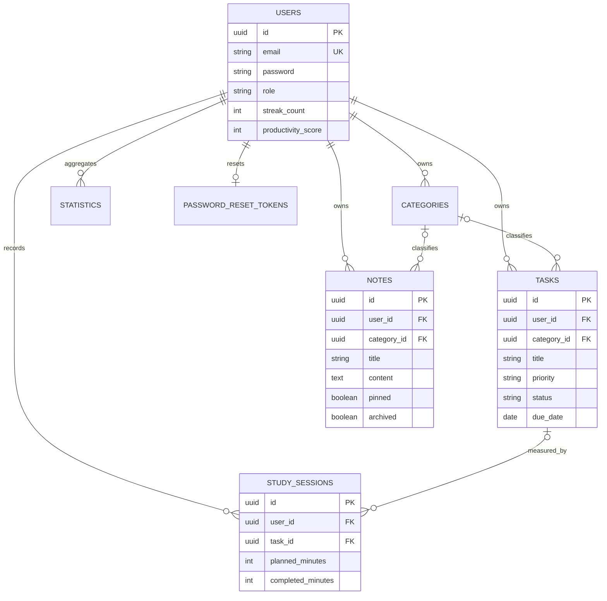

# Entity relationship diagram

`database/schema.sql` is the executable MySQL 8 schema. UUIDs are stored as `BINARY(16)`, relationships are protected by foreign keys, and high-use dashboard queries have composite indexes.
